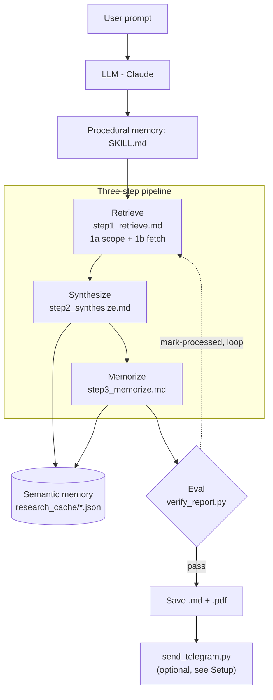

# Research-Advisory

A Claude Code plugin bundling research/advisory skills. Install the whole
plugin and every skill inside it becomes available; each skill is
self-contained under `skills/<skill-name>/` with its own `SKILL.md`,
scripts, and reference docs.

**Using a skill never touches the plugin directory itself.** Any working
state a skill builds up as you use it (fetched documents, drafted reports,
generated PDFs) is written to a dedicated folder in your home directory
instead — e.g. `report-generator` writes to `~/.report-generator/`, outside
this repo entirely. Installing, updating, or removing the plugin is
therefore always a clean operation on this directory alone; nothing a skill
does while running ever adds, modifies, or deletes a file here.

## Skills

| Skill | What it does |
|---|---|
| [`report-generator`](skills/report-generator/SKILL.md) | Generates/refreshes India-listed-company research reports (visual PDF + Markdown) from BSE filings (concall transcripts, investor presentations, annual reports, results, press releases, credit-rating disclosures), screener.in structured financials, and web-searched brokerage/industry research. Full pipeline, directory structure, and setup are documented in this README below (Usage and Setup sections); the skill's own `SKILL.md`, `pipeline/*.md`, and `reference/*.md` are the operational spec Claude reads at run time. |
| [`portfolio-analysis`](skills/portfolio-analysis/SKILL.md) | **Placeholder — not yet implemented.** Reserved for future portfolio-level analysis/advisory. |

More skills may be added here over time, each in its own `skills/<name>/` directory.

## Plugin structure

```
Research-Advisory/                    (plugin root -- everything here is the plugin)
|-- .claude-plugin/
|   |-- plugin.json                   Plugin manifest (name, version, description)
|   `-- marketplace.json              Marketplace manifest (self-references "." as
|                                       the plugin source -- lets this same repo be
|                                       added via the Add-marketplace UI/CLI)
|-- .gitignore
`-- skills/
    |-- report-generator/             One skill = one self-contained directory
    |   |-- SKILL.md                  Entry point Claude reads on trigger
    |   |-- pipeline/                 The 3 step files (what to do, in order)
    |   |-- reference/                8 topic docs the steps pull in on demand
    |   |-- scripts/
    |   |   |-- pipeline/             Scripts the 3 steps run
    |   |   `-- helpers/              Trackers + utilities called from a step
    |   |-- assets/                   report_style.css for the PDF template
    |   `-- examples/                 A worked reference report
    `-- portfolio-analysis/           Placeholder -- not yet implemented
        `-- SKILL.md

~/.report-generator/                  (OUTSIDE the plugin, in your home directory)
|-- research_cache/<company_slug>/    Working state, created the first time
|                                      you research a company
`-- output/<company_slug>/            Your local deliverables
                                       (<Company>_report.md/.pdf)
```

Every skill's working state and deliverables are written to its own
dedicated folder under your home directory (`~/.report-generator/` for
`report-generator`) — never inside `skills/<skill-name>/` itself. This
means the plugin directory is 100% reproducible from git: clone it, and
every file in it is exactly what's tracked, with nothing added, changed, or
removed by using the skill.

## Installation

**Install this plugin only through Cowork's own plugin/marketplace
management flow — never by asking Claude to install it for you inside a
regular chat conversation.** Plugin installs change what's available to
every future session, so they belong in Cowork's dedicated setup surface,
not as a side effect of a chat message. If you're in a chat session and want
this plugin, go to Cowork's plugin management (or use the CLI directly
yourself, as below) rather than asking Claude to run the install commands
on your behalf mid-conversation.

This repo is set up as **both** the marketplace catalog and the plugin
itself (self-referencing via `.claude-plugin/marketplace.json`'s
`"source": "."`), so you can install it either through Claude's plugin UI or
straight from the CLI — pick whichever you're using.

### Option A — via the marketplace (Claude Desktop UI or CLI)

**Add the marketplace:**

```bash
claude plugin marketplace add ajay1297/Research-Advisory
```

Or in the Claude Desktop/Code "Add marketplace" dialog, paste the repo URL
exactly as `https://github.com/ajay1297/Research-Advisory.git` (or the
`owner/repo` short form `ajay1297/Research-Advisory`) and press Sync. If you
still see *"no manifest found at .claude-plugin/marketplace.json"*, you're on
an older clone/cache of the repo from before that file existed — make sure
you've pulled the latest commit that adds it.

**Then install the plugin from it:**

```bash
/plugin install research-advisory@research-advisory
```

(or the equivalent option in the plugin picker once the marketplace is added).

### Option B — local dev/testing, no marketplace needed

```bash
git clone git@github.com:ajay1297/Research-Advisory.git
cd Research-Advisory
claude --plugin-dir .
```

Use `/reload-plugins` inside a running session to pick up changes without
restarting — useful while editing the plugin itself. Every skill under
`skills/` becomes available automatically. To make it load every session
without passing `--plugin-dir` each time, symlink the clone into your
personal plugins directory instead:

```bash
mkdir -p ~/.claude/plugins
ln -s "$(pwd)" ~/.claude/plugins/research-advisory
```

### After installing (either option)

Currently `skills/` has `report-generator` (fully implemented) and
`portfolio-analysis` (placeholder, not yet implemented). Install
dependencies (see Setup below), then confirm it installed correctly:

1. Both `research-advisory:report-generator` and `research-advisory:portfolio-analysis`
   should show up by name in the list of available skills in the system prompt
   (visible to Claude every turn once the plugin is installed) — no need to
   invoke anything first, they're just present.
2. Run `/research-advisory:report-generator <any company name>` (or the
   shorter `/report-generator <any company name>`) and check that Claude
   follows the `report-generator` pipeline end to end, creating
   `~/.report-generator/research_cache/<company_slug>/` and
   `~/.report-generator/output/<company_slug>/` (outside the plugin entirely —
   see Plugin structure above) as it goes.

## Setup

No API keys required to generate a report. One optional integration
(Telegram delivery of the finished PDF) needs a credential file outside the
plugin — see "Telegram delivery" below. Not every skill necessarily shares
the same dependencies; `report-generator`'s are below, and it's the only
implemented skill so far.

### `report-generator`

All sourcing is done via BSE's public JSON API (queried by the bundled
`bse_announcements.py`/`bulk_block_deals.py`, no key or auth required) plus web
search/fetch for screener.in, credit-rating agency sites, and brokerage/industry
research — nothing needs a server, daemon, or credentials.

**Python packages:**

```bash
pip install pdfplumber weasyprint matplotlib reportlab --break-system-packages
```

| Package | Used by | Required? |
|---|---|---|
| `pdfplumber` | PDF → plain text extraction | Yes, for every source PDF |
| `weasyprint` | Primary visual-PDF renderer | Yes, for the default PDF pipeline |
| `matplotlib` | Chart generation | Only if you ask for a chart version of a section — opt-in, not default |
| `reportlab` | Legacy text-only PDF fallback | Only if WeasyPrint can't be installed |

**System packages** (native libraries WeasyPrint and the PDF-verification step
need — not pip-installable):

```bash
# macOS
brew install pango poppler

# Debian/Ubuntu
sudo apt-get install libpango-1.0-0 libpangoft2-1.0-0 libcairo2 poppler-utils
```

`poppler` provides `pdftoppm`, used to visually check the rendered PDF (no
clipped tables, no dead whitespace) before delivery — this runs on every
report, not optional.

**Verify the install:**

```bash
python3 -c "import pdfplumber, weasyprint; print('ok')"
pdftoppm -v
```

Known gotchas and fallback behavior (what happens when a fetch fails, when
WeasyPrint isn't installed, when a PDF extraction comes back partial) are
documented inline in the skill's own `pipeline/*.md` and `reference/*.md` files, not duplicated
here — see the table below for which file covers which step.

### Telegram delivery (optional)

The last action of every run is sending the finished PDF to Telegram via
`scripts/pipeline/send_telegram.py`. Set it up once:

1. Message **@BotFather** on Telegram, run `/newbot`, and copy the bot token
   it gives you.
2. Message your new bot anything (so it can message you back), then open
   `https://api.telegram.org/bot<TOKEN>/getUpdates` and read `chat.id` off
   the response.
3. Create `~/.report-generator/telegram.env` (outside this repo, alongside
   the skill's other working state) containing:
   ```
   TELEGRAM_BOT_TOKEN=<token>
   TELEGRAM_CHAT_ID=<chat id>
   ```

If this file is missing, `send_telegram.py` fails loudly (non-zero exit,
message on stderr) rather than silently skipping delivery — the `.md`/`.pdf`
are still saved locally either way; Telegram delivery failing doesn't fail
the report itself.

## Usage

`report-generator` is invoked explicitly via
`/research-advisory:report-generator <argument>` or `/report-generator
<argument>` — it does not auto-trigger from a plain-language mention of a
company in conversation (see the skill's own `SKILL.md` frontmatter). The
argument is a free-text company name/ticker plus optional intent words that
tell Claude which of four things you mean:

**1. Generate a report for a new company** — full pipeline, first run:

```
/report-generator <Company Name>
/report-generator generate a report on <Company Name>
/report-generator build me a thesis on <Company Name>
```

**2. Update the report for an already-generated company** — the cheap default
path; only refetches what's actually changed since the last run:

```
/report-generator regenerate <Company Name>'s report
/report-generator refresh <Company Name>'s report
/report-generator update <Company Name>'s report
```

**3. Re-generate the report from scratch for an already-generated company** —
explicitly bypasses the cache and refetches/rebuilds everything (tracker
histories like guidance/fundraise/rating/litigation are cumulative records and
are never wiped, from-scratch or not):

```
/report-generator regenerate <Company Name>'s report from scratch
/report-generator rebuild <Company Name> from scratch
/report-generator ignore the cache and redo <Company Name>
```

**4. Invoking without a company name** — Claude won't guess or silently reuse
a company from earlier in the conversation; it asks which company you mean
before doing anything else.

Also: `/report-generator rerun for <Company A> and <Company B>` processes
multiple companies independently in one request, and uploading a concall
transcript, investor presentation, or annual report PDF alongside the slash
command also feeds the skill, preferring the uploaded document over fetching
one.

Every run ends with both `~/.report-generator/output/<company_slug>/<Company>_report.md`
and `~/.report-generator/output/<company_slug>/<Company>_report.pdf` — PDF export
is automatic, never a separate ask. Architecture, the end-to-end flow, and
the section-by-section source mapping are covered in the two subsections
below.

#### Pipeline flow



#### Pipeline steps and the files each one touches

The pipeline runs as three steps, each owned by its own file under
`skills/report-generator/pipeline/`. Files with no extension shown are `.md` and
live in `skills/report-generator/reference/`; `.py` files live in
`skills/report-generator/scripts/pipeline/` or `scripts/helpers/`; JSON/HTML/PDF
files live under `~/.report-generator/` (`research_cache/<slug>/` or
`output/<slug>/`, as noted in Setup above).

| Step | Step file | Reference docs it reads | Scripts it invokes | Data files it reads/writes |
|---|---|---|---|---|
| 1a — Retrieve: scope the window | `step1_retrieve.md` | `data_sources.md`, `sourcing_depth.md`, `SKILL.md` | `bse_announcements.py`, `check_freshness.py` | `state.json`, `report.md`, `bullets.json` |
| 1b — Retrieve: fetch + extract | `step1_retrieve.md` | `data_sources.md`, `sourcing_depth.md`, `step3_memorize.md` | `bse_announcements.py`, `pdf_to_text.py`, `pdf_to_text_parallel.py`, `semantic_search.py`, `extract_theme_quotes.py`, `source_manifest.py` | `sources/<slug>/`, `source_manifest.json`, `candidate_quotes/*.json` |
| 2 — Synthesize (draft sections) | `step2_synthesize.md` | `step1_retrieve.md`, `report_format.md`, `report_sections.md`, `source_playbook.md` | `guidance_tracker.py`, `capacity_utilization.py`, `fundraise_tracker.py`, `rating_tracker.py`, `litigation_tracker.py`, `bulk_block_deals.py` | `quotes.json`, `guidance_history.json`, `fundraise_history.json`, `rating_history.json`, `litigation_history.json` |
| 3 — Memorize (save + verify) | `step3_memorize.md` | `step1_retrieve.md`, `report_assembly.md`, `guardrails.md` | `html_helpers.py`, `charts.py`, `verify_report.py`, `report_to_pdf.py`, `send_telegram.py`, `check_freshness.py` | `report.html`, `*_report.pdf`, `report.md`, `quotes.json`, `bullets.json`, `source_manifest.json`, 4 tracker histories (guidance/fundraise/rating/litigation), `state.json`, `~/.report-generator/telegram.env` (read, not written) |

Steps 1a and 1b share one file because 1a's only output — the fetch window and the
decision of how much to re-run — is exactly 1b's input; splitting them across two
files meant every reader had to hold both open anyway.

"Scripts it invokes" means the step actually runs them. Several step files *name*
scripts they don't run — `step1_retrieve.md` names `guidance_tracker.py` when
describing the `new_quarter` path, and `step3_memorize.md` documents the tracker
scripts that Step 2 invokes — so the column is deliberately narrower than a grep for
`.py` would suggest.

**Step 1a can also end the run outright.** In the `up_to_date` branch, when the user
supplied nothing but a new price, the cached revenue-guidance/margin/share inputs come
out of `bullets.json`, the forward PE is recomputed inline (it's four operations —
there is no script for it), and the run finishes without ever entering 1b.

**Sourcing is BSE-first, and date-windowed.** Both halves of Step 1 run
`bse_announcements.py`, which queries BSE's own JSON API with a date range and returns
each filing's date, category, headline, and direct PDF URL. 1a uses it for *dates
only* (the cheapest possible freshness check — no PDF is fetched); 1b re-runs it over
the window `check_freshness.py` computed and fetches what it returns.

That window is the incremental lever. On a refresh it runs from the last successful
run's timestamp minus a 7-day overlap buffer through today — so a run on 21 Jul 2026
whose last success was 1 Jul sweeps 24 Jun onward, not 18 months. The buffer is
deliberate: BSE filings land late, get amended, and get recategorized, so a window
starting exactly at the last success drops them silently. A first-time or from-scratch
run has no prior state to be incremental against, so it falls back to the full standard
depth (18 months; 24 for annual reports). Because the date filter is applied by the API
itself, the incremental sweep is a genuinely narrow query rather than a wide fetch
that gets discarded — and a dedupe against `sources/<slug>/` keeps the PDF fetches
narrow too.

Seven standard sweeps cover annual reports, financial results, press releases,
investor presentations, earnings-call transcripts, credit ratings, and an unfiltered
catch-all for order wins and governance events — the set is tabulated in
`reference/data_sources.md`. Only the three things with no exchange filing behind them
come from elsewhere: brokerage research and industry/macro context (`WebSearch`), and
company social posts (LinkedIn/X).

**Where memory is written vs. documented.** `source_manifest.py` is *invoked* in
Step 1 — one `add-document` call immediately after each extraction, never batched —
but the model behind it is *documented* in `step3_memorize.md`'s "What gets recorded,
and when," which is why it appears in both rows above. The timing matters:
`sources/<slug>/` holds multi-MB PDFs and gets deleted to save space, and the
manifest is what survives that so `verify_report.py depth`/`extraction` can still
confirm the sourcing depth was met. The same file also records sweeps that found
nothing, which keeps "the check was skipped" distinguishable from "the check ran and
came up empty."

Two cross-cutting files every step reads but none of them "owns":
`reference/rules_and_validation.md` (standing constraints — token
discipline, never-drop-anything-silently, accuracy discipline) and
`reference/guardrails.md` (the `verify_report.py` checklist reference).
Step 3's Memorize is also where the loop closes: `check_freshness.py
--mark-processed` writes `state.json` — including the `last_success_at` stamp that
the *next* run's Step 1a counts its delta window back from — which that run reads
back to decide both how much of the pipeline needs to re-run and how far back to
sweep BSE.
